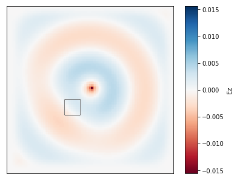

# fdfdpy

This is a pure Python implementation of the finite difference frequency domain (FDFD) method. It makes use of scipy, numpy, matplotlib, and the MKL Pardiso solver. fdfdpy currently supports 2D geometries

## Structure

### Initialization

The `Fdfd` class is initialized as

	simulation = Fdfd(omega, eps_r, dl, NPML, pol, L0)

- `omega` : the angular frequency in units of` 2 pi / seconds`
- `eps_r` : a numpy array specifying the relative permittivity distribution
- `dl` : the spatial grid size in units of `L0`
- `NPML` : defines number of PML grids `[# on x borders, # on y borders]`
- `pol` : polarization, one of `{'Hz','Ez'}` where `z` is the transverse field.
- `L0` : simulation length scale, default is 1e-6 meters (one micron)

Creating a new Fdfd object solves for:

- `xrange` : defines spatial domain in x [left-most position, right-most position] in units of `L0`
- `yrange` : defines spatial domain in y [bottom-most position, top-most position] in units of `L0`
- `A` : the Maxwell operator, which is used later to solve for the E&M fields.
- `derivs` : dictionary storing the derivative operators.

It also creates a relative permeability, `mu_r`, as `numpy.ones(eps_r.shape)`. 

### Solving for the electromagnetic fields

Now, we have everything we need to solve the system for the electromagnetic fields, by running

	fields = simulation.solve_fields(b, timing=False)
	
`b` is proportional to either the `Jz` or `Mz` source term, depending on whether `pol` is set to `'Ez'` or `'Hz'`, respectively.  PLEASE NOTE: `b` is exacly the source for `Ax = b`, it is not a current density!.  `b.shape` must be `(Nx,Ny)`.

`fields` is a tuple containing `(Ex, Ey, Hz)` or `(Hx, Hy, Ez)` depending on the polarization.

### Setting a new permittivity

If you want to change the permittivity distribution, you may run

	simulation.reset_eps(new_eps)

And this will reconstruct the system matrix and store it in `FDFD`.

### Plotting

Primary fields (Hz/Ez) can be visualized using the included helper functions:

	simulation.plt_re(outline=True, cbar=True)
	simulation.plt_abs(outline=True, cbar=True)

These optionally outline the permittivity with contours and can be supplied with a matplotlib axis handle to plot into.

### Requirements

- numpy
- scipy
- matplotlib

To load the MKL solver:

	git submodule update --init --recursive

### To Do

#### By end of week ending 08/10
- [ ] Rewrite the nonlinear_solvers functions in view of recent changes 
- [x] Test an optimization of a linear system

#### Whenever
- [ ] Modal source.
- [ ] More dope plotting methods.
- [ ] Add ability to run local jupyter notebooks running FDFD on parallel from hera.
- [ ] Save the factorization of `A` in the `Fdfd` object to be reused later if one has the same `A` but a different `b`.
- [ ] Allow the source term to have `(Jx, Jy, Jz, Mx, My, Mz)`, which would be useful for adjoint stuff where the source is not necessarily along the `z` direction.
- [ ] Clean up imports (e.g. `import numpy as np` to `from numpy import abs, zeros, ...`)
